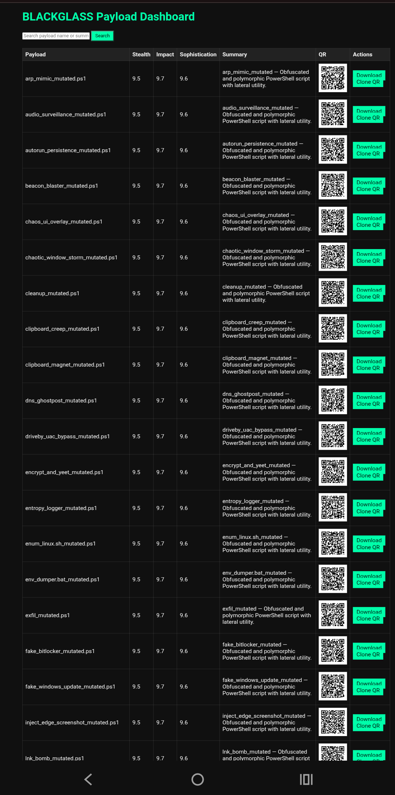

# BLACKGLASS

[](https://github.com/GnomeMan4201/BLACKGLASS/actions/workflows/python-ci.yml)
[](https://github.com/GnomeMan4201/BLACKGLASS/actions/workflows/docs.yml)
[](LICENSE)

---

## Overview

BLACKGLASS is an advanced offensive security toolkit designed for payload mutation, stealth beacon monitoring, autonomous QR/ZIP flyer creation, and AI-powered payload scoring — all optimized for Termux, Linux, and headless deployments.

It combines automated payload mutation, local offline AI scoring via llama.cpp, stealth beacon tracking, and convenient HTML flyer generation into a single modular suite.

---

## Features

- **Master automation:** End-to-end scoring, flyer generation, QR code creation, and ZIP packaging
- **AI-driven payload mutation:** Generates unique, obfuscated payload variants to bypass detection
- **HTML flyer & QR code generation:** Easy-to-share, stealthy payload delivery flyers
- **Live beacon monitoring:** Track flyer interactions and callbacks in real-time locally
- **Fully local/offline:** Designed to work without cloud dependencies, ideal for air-gapped or stealthy environments
- **AI scoring with Llama.cpp:** Payloads are scored locally for stealth, impact, and sophistication — no data leaves your environment

---

## Command Overview

| Script/Module          | Description                                      |
|-----------------------|------------------------------------------------|
| `blackglass_forge.py`  | Master automation: scoring, flyers, QR, ZIP    |
| `mutate_payload.py`    | AI driven payload mutation engine                |
| `qr_flyer_builder.py`  | HTML flyer & QR code generator                    |
| `zip_exporter.py`      | Auto package bundles for delivery                 |
| `beacon_server.py`     | Local stealth beacon monitoring                   |
| `score_payload.py`     | Offline payload scoring (llama.cpp)               |
| `dashboard.py`         | Dashboard for all payloads and reports            |
| `blackglass_demo.sh`   | Launch demo                                        |

---

## Screenshots

<p align="center">
  
</p>

*BLACKGLASS: Dashboard, AI scoring, and beacon logs in Termux*

---

## Quick Start

```bash
git clone https://github.com/GnomeMan4201/BLACKGLASS_Suite.git
cd BLACKGLASS_Suite
pip install -r requirements.txt
python3 blackglass_forge.py
