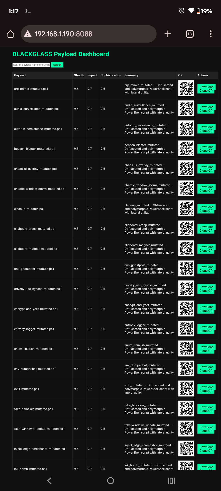

  

 


## Demo




## Demo


# Blackglass_Suite - Security Tooling

> **Legal Notice**: For authorized security testing, education, and research only. Users must comply with all applicable laws.

[](https://github.com/GnomeMan4201/Blackglass_Suite/actions)
[](SECURITY.md)

## Quick Start

```bash
git clone https://github.com/GnomeMan4201/Blackglass_Suite.git
cd Blackglass_Suite
./quickstart.sh
```

## Overview

Professional security tool for red team operations and security research.

## Features

- Enterprise-grade security testing
- Modular architecture
- Comprehensive documentation
- Active maintenance

## Installation

```bash
# Docker
docker-compose up -d

# Manual
pip install -r requirements.txt
```

## Documentation

Full documentation: [docs/](docs/)

## Security

Report vulnerabilities: [SECURITY.md](SECURITY.md)

## License

GPL-3.0 - See [LICENSE](LICENSE)
