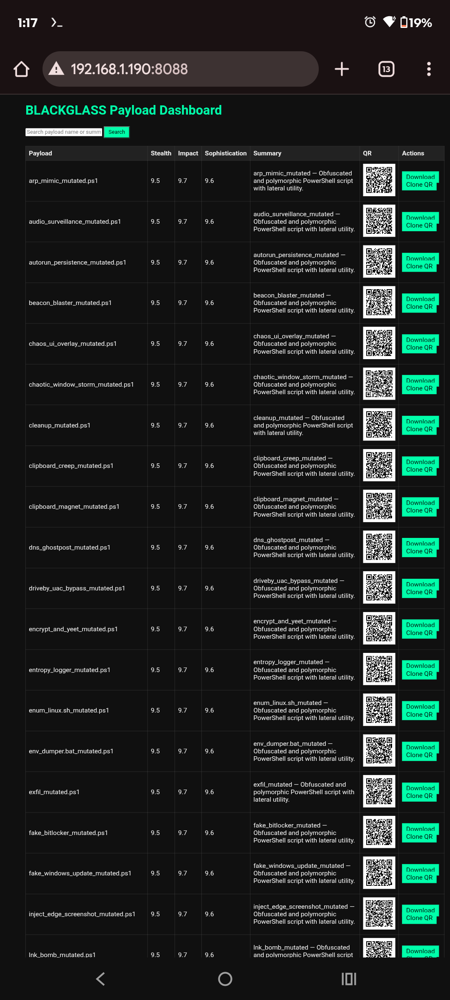

# Blackglass Suite

**Offline payload forge — QR delivery, PowerShell staging, and stealth persistence for red team operations.**

[](LICENSE)
[](#)

---

<p align="center">
  
</p>

---

Blackglass Suite is a payload delivery and staging toolkit that operates entirely offline. It forges QR code payloads, generates HTA launchers, and ships a full PowerShell payload library covering persistence, surveillance, exfiltration, and evasion — all without touching external infrastructure during generation.

---

## Capabilities

**Forge scripts**
- QR code payload generation (7 forge variants)
- HTA launcher generation
- LNK dropper forge

**PowerShell payload library**
- `arp_mimic.ps1` — ARP table manipulation
- `audio_surveillance.ps1` — microphone capture
- `autorun_persistence.ps1` — registry/startup persistence
- `beacon_blaster.ps1` — C2 beacon
- `clipboard_magnet.ps1` / `clipboard_creep.ps1` — clipboard harvesting
- `dns_ghostpost.ps1` — DNS exfiltration
- `driveby_uac_bypass.ps1` — UAC bypass
- `encrypt_and_yeet.ps1` — data encryption and exfil
- `entropy_logger.ps1` — keystroke entropy capture
- `exfil.ps1` — data exfiltration
- `fake_bitlocker.ps1` — credential harvest via fake BitLocker prompt

**Integrations**
- Plugin integration with OWN, badBANANA, and Decoy-Hunter

---

## Install
```bash
git clone https://github.com/GnomeMan4201/Blackglass_Suite.git
cd Blackglass_Suite
./quickstart.sh
```

---

## Legal

For authorized security research and red team operations in controlled environments only. Unauthorized use is prohibited.

---

*Blackglass Suite // badBANANA research // GnomeMan4201*
