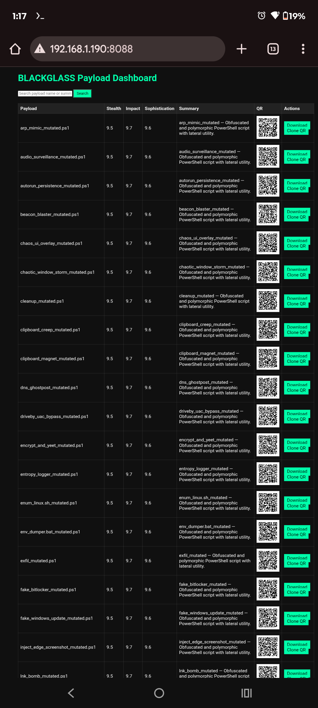

# Blackglass Suite

**Offline payload research forge for controlled red-team labs — QR delivery artifacts, launcher generation, and PowerShell research modules.**

[](https://github.com/GnomeMan4201/Blackglass_Suite/actions/workflows/ci.yml)
[](LICENSE)
[](#requirements)

---

<p align="center">
  
</p>

---

## Overview

Blackglass Suite is a local-first research toolkit for generating and studying delivery/staging artifacts in authorized environments. Generation is performed locally rather than through a hosted control plane, which makes the repository useful for lab work, defensive inspection, repeatable demonstrations, and offline experimentation.

The maintained repository groups two areas of work:

- **artifact generation** — QR, HTA, and LNK-oriented forge workflows
- **PowerShell research modules** — examples covering persistence, collection, staging, exfiltration, and evasion behaviors

The repository contains dual-use techniques. Treat generated artifacts as lab material and run them only in systems you control or are explicitly authorized to assess.

---

## Requirements

- Python 3.10+ recommended
- Linux or Termux
- `git`
- Python packages declared in `requirements.txt`

A virtual environment is recommended on standard Linux installations.

---

## Quick install

```bash
git clone https://github.com/GnomeMan4201/Blackglass_Suite.git
cd Blackglass_Suite
python3 -m venv .venv
source .venv/bin/activate
python -m pip install --upgrade pip
pip install -r requirements.txt
```

For the repository's safe dependency/demo sanity check:

```bash
bash quickstart.sh
```

`quickstart.sh` verifies the checkout context and Python environment and installs declared dependencies when needed. It is a **smoke check**, not proof that every generated artifact works in every target environment.

---

## Verify the checkout

CI uses a fail-closed runtime validation path:

```bash
# When pytest tests are present:
python -m pytest tests/ -v --tb=short

# Otherwise, compile the active Python source:
python -m compileall -q -x '(^|/)(\.venv|venv)(/|$)' .

# Safe repository smoke check:
bash quickstart.sh
```

Bandit is run separately as an **advisory** security scan. It is not used as a hard pass/fail gate because this repository intentionally contains red-team patterns that static analyzers can flag by design. Runtime/install validation itself is not allowed to silently pass on failure.

---

## Capabilities

### Forge scripts

- QR-code payload artifact generation across multiple forge variants
- HTA launcher generation
- LNK-oriented dropper forge workflows

### PowerShell research library

Representative modules include:

| Module | Research behavior |
|---|---|
| `arp_mimic.ps1` | ARP manipulation behavior |
| `audio_surveillance.ps1` | microphone collection behavior |
| `autorun_persistence.ps1` | startup/registry persistence behavior |
| `beacon_blaster.ps1` | beaconing behavior |
| `clipboard_magnet.ps1` / `clipboard_creep.ps1` | clipboard collection |
| `dns_ghostpost.ps1` | DNS-based transfer behavior |
| `driveby_uac_bypass.ps1` | UAC-bypass research |
| `encrypt_and_yeet.ps1` | encryption/exfiltration workflow |
| `entropy_logger.ps1` | input/entropy collection research |
| `exfil.ps1` | data-transfer behavior |
| `fake_bitlocker.ps1` | credential-prompt simulation |

The module names describe behaviors represented in the repository; they are not claims that a technique will evade a particular current EDR, OS build, or policy configuration.

---

## Repository hygiene

Historical working-directory backup snapshots have been removed from the active branch. Git history remains the record of prior repository states; current source and validation paths now operate only on the maintained tree.

---

## Verification boundary

A green CI run establishes that dependencies install and the configured active-source/test/smoke path completes successfully for that revision. It does not establish operational effectiveness, stealth, compatibility with every target, or authorization to use generated material outside a controlled environment.

---

## License

GPL-3.0. See [LICENSE](LICENSE).

---

*Blackglass Suite // badBANANA research // GnomeMan4201*
